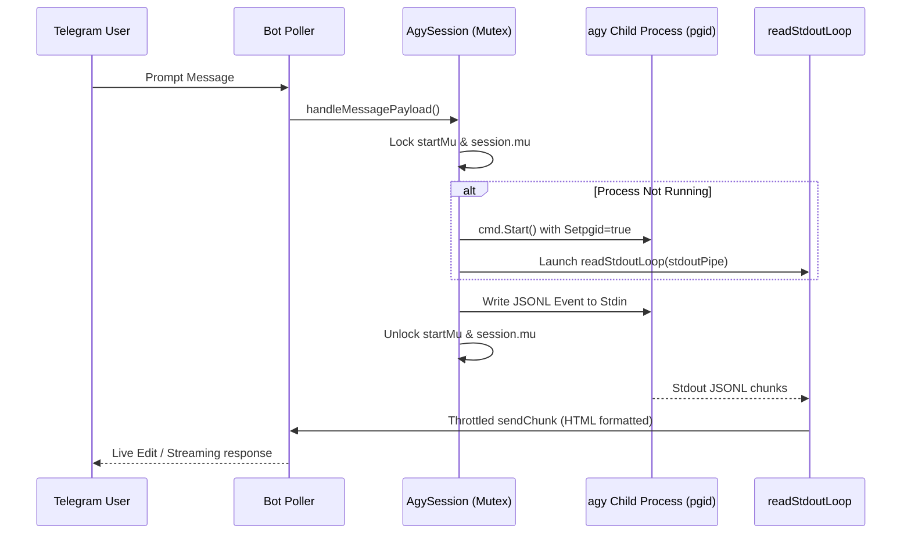
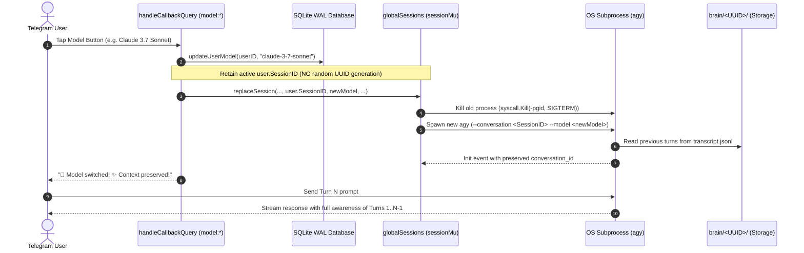
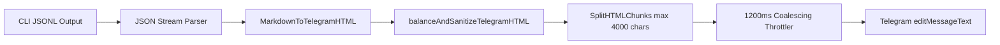
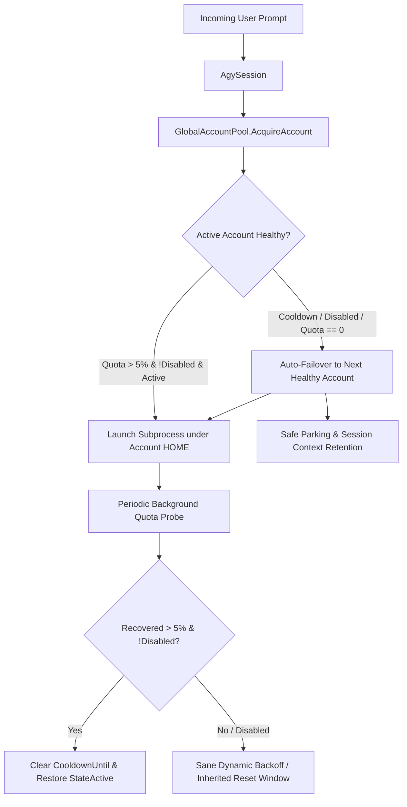
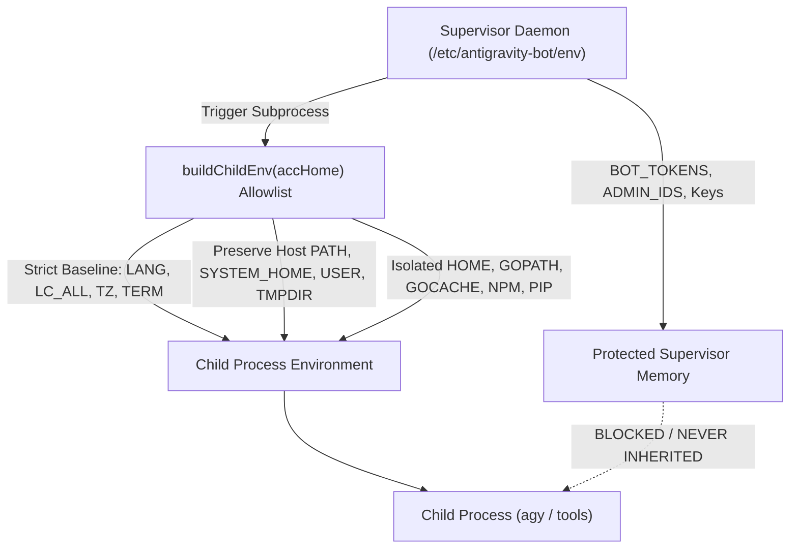
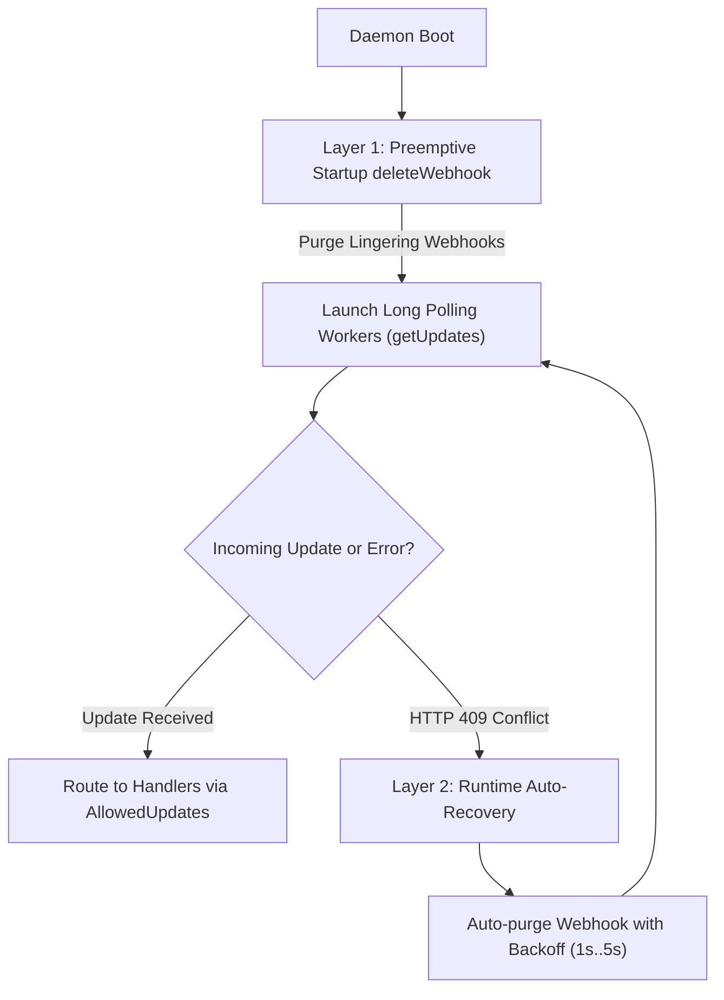
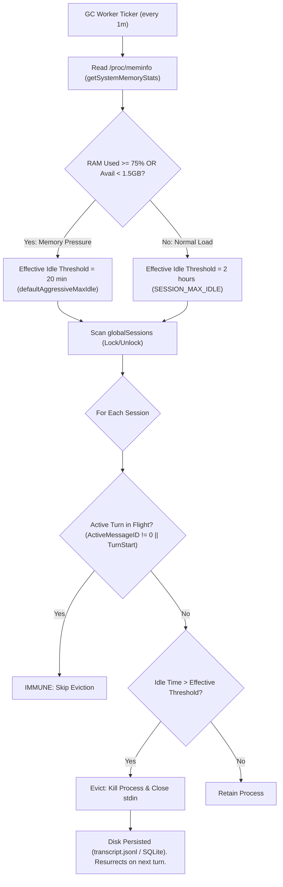

# 🛸 Antigravity Telegram Agent — Architecture Specification

## 1. Executive Summary

The `antigravity-telegram-agent` is an ultra-low-latency, concurrent Telegram Gateway and session supervisor written in pure Go for Google Antigravity CLI (`agy`) headless agentic workflows. 

Rather than embedding heavy runtime dependencies directly into bot processes, the engine acts as an asynchronous multiplexing bridge between the Telegram Bot API and isolated agent CLI subprocesses. Each user interacts with an isolated runtime environment with robust state persistence, non-blocking I/O streaming, real-time Markdown-to-HTML conversion, and self-healing error recovery.

```mermaid
flowchart TD
    TG[Telegram Clients] <-->|Long-Polling / Pure Go| Bot[Telegram Bot Poller]
    Bot -->|Recover / Route| Dispatcher[handleUpdate Dispatcher]
    
    subgraph Handlers ["Modular Handler Layer"]
        Dispatcher -->|Slash Commands| CmdHandler[handleCommand]
        Dispatcher -->|Inline Buttons| CbHandler[handleCallbackQuery]
        Dispatcher -->|Media & .md Exports| MediaHandler[downloadTelegramMedia]
        Dispatcher -->|Prompt Stream| MsgHandler[handleMessagePayload]
        CmdHandler -->|/stop & /cancel| StopHandler[handleStopCommand]
        CbHandler -->|cmd:stop| StopHandler
        CbHandler -->|cmd:retry| MsgHandler
    end
    
    subgraph SessionManager ["Session Manager & Resilience Supervisor"]
        MsgHandler -->|Stdin Pipe JSONL| Session[AgySession]
        Session -->|pgid Process Group| Subproc["os/exec (agy cli)"]
        Subproc -->|Stdout JSONL Stream| StdoutLoop[readStdoutLoop]
        StdoutLoop -->|Throttled Batching 1200ms| Throttler[Stream Throttler (1200ms)]
        Throttler -->|HTML Chunks / EditMessage| TG
        Session -->|15m Inactivity / 45m Hard Deadline| Watchdog[Turn Watchdog & Buffer Salvager]
        Watchdog -->|Timeout Stall / SIGKILL -pgid| Session
        Watchdog -->|Salvaged Buffer & Artifacts| TG
        StopHandler -->|Interrupt Turn / SIGKILL -pgid| Session
        StopHandler -->|Salvaged Buffer & Artifacts| TG
        StdoutLoop -->|Google Cloud 429| Parking[429 Quota Safe Parking]
        Parking -->|Auto-Export Markdown File| TG
    end

    subgraph Storage ["SQLite WAL Storage & File Tree"]
        CmdHandler <-->|PRAGMA journal_mode=WAL| DB[(SQLite sessions.db)]
        CbHandler <-->|Session History & Voice State| DB
        Session <-->|Conversation State| Brain["~/.gemini/antigravity-cli/brain"]
    end

    subgraph TTS ["Audio Engine"]
        StdoutLoop -.->|VoiceReply Enabled| AudioPipeline[Multi-Engine Audio Pipeline (Edge-TTS, Piper, ElevenLabs, Hybrid)]
        CmdHandler -.->|/tts Command| AudioPipeline
        AudioPipeline -->|Voice Note OGG/MP3| TG
    end
```

---

## 2. Core Architectural Pillars

### 2.1 Concurrency & Race-Free Thread Model
The gateway is engineered under strict Go concurrency invariants (`go test -race` validated):

* **Granular Mutex Protection (`session.mu sync.Mutex`)**: Guards session mutable fields (`Stdin`, `isAlive`, `Conversation`, `BotAPI`, `ChatID`, `ActiveMessageID`, `TextBuffer`, `VoiceReply`).
* **Subprocess Startup Serialization (`session.startMu sync.Mutex`)**: Guarantees that concurrent incoming user prompts cannot spawn duplicate child processes or race during `os/exec.Command.Start()`.
* **Safe Pointer Publishing**: Child `session.Stdin` and `session.Cmd` are published exclusively **after** successful `cmd.Start()`, preventing nil-pointer dereferences in concurrent readers.
* **Process Group Isolation (`Setpgid: true`)**: All spawned `agy` processes are assigned a dedicated process group (`syscall.Kill(-pgid, syscall.SIGKILL)`). On `/clear`, `/workspace`, or daemon shutdown, entire child process trees (including compiler sub-processes and Python workers) are reliably terminated without leaving orphaned zombies.
* **Mutex-Decoupled Process Termination (`AgySession.Kill()`)**: Mutex `session.mu` locks state updates exclusively for fast field mutation (`isAlive = false`, zeroing pointers). Blocking I/O (`Stdin.Close()`) and kernel process signals (`syscall.Kill`) execute outside the lock, preventing thread contention and eliminating potential deadlocks during concurrent stream reads.



### 2.2 Subprocess Watchdog & State T Deadlock Immunity
When background or verification commands (e.g. MCP stdio servers, smoke tests) attempt to read `stdin` without a connected TTY or outside foreground job control, the Linux kernel delivers `SIGTTIN` (or `SIGTTOU`), suspending the child in `State: T` (Stopped). If wrapped with commands like `timeout` without the `-k` (`--kill-after`) flag, the process fails to process `SIGTERM`, resulting in an unrecoverable agent turn deadlock.

The engine incorporates a dedicated autonomous watchdog ([`subprocess_watchdog.go`](../subprocess_watchdog.go)):
* **Pure Go `/proc` Traversal**: Iterates `/proc` and parses `/proc/[pid]/stat` directly without external `ps` overhead or shell execution.
* **Process Tree Ancestry Resolution**: Traces parent-child hierarchy to identify descendants belonging exclusively to active agent root sessions (`AgySession`).
* **Two-Phase Forced Termination**: When any descendant process remains suspended in `State: T` or `State: t` beyond the grace period (default 3 seconds), the watchdog issues a sequenced `SIGCONT` (awakening the process) followed by `SIGKILL` (unconditional kernel termination).
* **Background Supervisor Worker**: `StartSubprocessWatchdogWorker` runs continuously on a 2-second ticker, fully integrated into the engine lifecycle alongside session garbage collection.

### 2.3 Inactivity Turn Watchdog & Buffer Salvaging Pipeline
During execution of complex tasks, external tool invocations, or network stalls, an agent process might stall without producing stream output. To prevent deadlocks, `session.go` implements an autonomous **Inactivity Turn Watchdog**:

* **15-Minute Inactivity Window (`turnTimeout = 15 * time.Minute`)**: Evaluated on a 5-second polling loop (`watchdogInterval = 5 * time.Second`), configurable via `TURN_INACTIVITY_TIMEOUT_MINUTES` or `TURN_TIMEOUT_MINUTES`.
* **45-Minute Hard Turn Deadline (`hardDeadline = 45 * time.Minute`)**: Acts as a failsafe against infinite loops, configurable via `TURN_HARD_DEADLINE_MINUTES`. Active turns with continuous progress (`s.LastActivity` fresh) run uninhibited up to this safety ceiling.
* **Granular Heartbeat on All JSONL Events**: Field `s.LastActivity` is atomically refreshed whenever any JSONL step arrives (`init`, `user`, `tool_use`, `tool_result`, `model`, `step_finish`). Long-running tools emitting stdout do not trigger premature timeouts.
* **Buffer Salvaging & Artifact Delivery**: If `time.Since(s.LastActivity) > turnTimeout` or `time.Since(s.ActiveTurnStart) > hardDeadline`, the watchdog triggers fail-safe salvage:
  1. `s.Kill()` sends `syscall.Kill(-pgid, SIGTERM)` followed by `SIGKILL` to eradicate the stuck process group.
  2. The accumulated `s.TextBuffer` is retrieved under lock and appended with a diagnostic reason notice (clearly distinguishing between inactivity and hard turn deadline).
  3. The salvaged content is converted through `MarkdownToTelegramHTML` and flushed to Telegram.
  4. Any created artifacts (`file://...`) in the salvaged text are extracted and delivered via `sendArtifacts`.
  5. The conversation UUID in SQLite is preserved, and the bot immediately returns to ready state.

### 2.4 Stream Auto-Recovery & Quota Safe Parking (429)
The engine provides automated fault recovery across unreliable upstream networks and quota boundaries:

* **Automatic Stream Recovery with Buffer Salvaging (Up to 2 Retries)**:
  When upstream Google Cloud streaming connections sever mid-turn, `readStdoutLoop` detects the drop. If `s.StreamRetries < 2`, the engine increments the counter, preserves the accumulated `s.TextBuffer`, displays a non-destructive auto-recovering status notice without erasing previously generated output, restarts the subprocess (`s.start()`) with the conversation context, and feeds an internal continuation prompt (`The streaming connection was interrupted mid-turn...`). Any new token deltas append seamlessly to the preserved buffer. If retries are exhausted or restart fails, the full accumulated text buffer is salvaged and delivered to Telegram, any referenced artifacts are extracted and sent, and an inline `🔄 Resume task` (`cmd:retry`) button is attached. All CLI print timeouts and generic agent errors likewise salvage accumulated output rather than discarding it.
* **429 Quota Safe Parking**:
  If the model returns a genuine rate limit (`429`, `RESOURCE_EXHAUSTED`, `quota`), the engine automatically triggers `handleExportCommand`, compiles the conversation transcript into a Markdown export document (`session_<title>.md`), and delivers it to the Telegram chat. The active turn is cleanly concluded without corrupting SQLite or leaving hanging processes.
* **Drop-to-Resume Workflow**:
  When a user forwards or uploads any `session_*.md` export file to the chat, `downloadTelegramMedia` detects the session export prefix and injects an automated prompt (`📋 Previous session context loaded from export file...`). The agent ingests the previous transcript and resumes execution seamlessly.

---

## 3. Modular Handler Decomposition

The monolithic message processing loop has been refactored into modular, testable components:

| Handler Function | Responsibility | Concurrency & Security Rules |
| :--- | :--- | :--- |
| `handleStartCommand` | Live agent terminal dashboard (CWD, model, session uptime, steps count, quick action buttons). | Non-blocking file reads from `.title` and `transcript.jsonl`. |
| `handleResumeCommand` | Interactive session picker with relative modification timestamps and `<USER_REQUEST>` prompt titles. | Queries SQLite history + reads `brain` directory. |
| `handleModelCommand` | Dynamic model selection keyboard. | Read-locked cache (`modelsMu.RLock()`). |
| `handleRefreshModelsCommand` | Live fetch of supported LLMs from `agy models`. | Write-locked cache update (`modelsMu.Lock()`). |
| `handleUsageCommand` | Token quota and API tier usage display. | Executes `agy --print /usage`. |
| `handleAccountsCommand` | Multi-account pool manager, live account switching, and quota diagnostics (`/accounts`). | Thread-safe pool reads, interactive action callbacks, and admin-guarded mutations. |
| `handleHelpCommand` | Quick command reference and operational guide. | Pure static format. |
| `handleTTSCommand` | Text-to-Speech synthesis for arbitrary user text (`/tts <text>`). | Hybrid engine (Edge-TTS primary -> Piper TTS CPU failover -> ElevenLabs key pool). |
| `handleTTSEngineCommand` | Inspect or switch active Text-To-Speech engine (`/tts_engine [engine]`). | Thread-safe dynamic engine override and configuration inspector. |
| `handleVoiceToggleCommand` | Persistent toggle for agent voice responses (`/voice [on\|off]`). | Atomic SQLite update to `users.voice_reply` and active in-memory session sync. |
| `handleWorkspaceCommand` | Dynamic agent working directory switching. | Path traversal validation (`isPathUnderRoot`, restricted to `PROJECTS_DIR` or bot's own office). |
| `handleRenameCommand` | Live rename of conversation title in `brain` storage. | Sanitizes title and validates conversation ID against path traversal. |
| `handleExportCommand` | Compiles full conversation transcript JSONL into a clean Markdown file attachment. | Validates session ID format (`isValidSessionID`), writes export file to scratch space. |
| `handleClearCommand` | Session context reset for clean startup. | Cleans session state in DB and memory, launches fresh process without uninitialized conversation ID flags. |
| `handleStopCommand` | Gracefully interrupts active turn without clearing conversation context. | Mutex-decoupled state extraction, `s.Kill()` process group termination, output buffer salvaging, and artifact delivery. |
| `handleCommand` | Centralized strict command token router (`switch cmd`). | Strips `@botName` and matches exact command tokens, eliminating prefix collisions (`/workspacex`, etc.). Translates Telegram-safe underscore aliases (`/grill_me` -> `/grill-me`, `/teamwork_preview` -> `/teamwork-preview`), which are registered as bot commands in `main.go` and normalized in `handlers.go`. Routes `/stop` and `/cancel`. |
| `handleCallbackQuery` | Routes inline button actions (`model:*` [Hot Model Swap], `resume:*`, `ans_id:*`, `cmd:*` including `cmd:stop` [Turn Interruption] and `cmd:retry` [Stream Recovery]). | Broken Object Level Authorization (BOLA) guard (`isSessionOwnedByUser`), safe UTF-8 byte truncation (`truncateUTF8Bytes`), safe prefix slicing, and expired callback query feedback. |
| `downloadTelegramMedia` | Downloads incoming documents, photos, audio, and voices. Detects session export files (`session_*.md`) and auto-injects context reload prompts for drop-to-resume. | URL scheme & host validation (HTTP/HTTPS only), HTTP status check, 100 MB hard limit, and sandbox download dir. |
| `handleMessagePayload` | Streams user prompt into agent `Stdin` and triggers instant `sendChatAction`. | Enforces JSONL protocol encoding, per-turn voice reply mode without latching, and clean prompt retry on Stdin error. |
| `sendTypingAction` | Background 4-second ticker sending `ChatTyping` / `ChatRecordVoice` while agent thinks. | Non-blocking mutex check. |
| `ExtractAllowedArtifacts` | Validates and dispatches generated documents/artifacts to Telegram. | Fail-closed LFI sandbox (`isPathUnderRoot`) covering `AGENTS_DIR`, `BRAIN_DIR`, and `PROJECTS_DIR` (`!info.IsDir()`). |
| `sendArtifacts` | Sends verified artifacts as Telegram documents. | Opens file descriptors directly (`os.Open`) and streams via `tgbotapi.FileReader`, eliminating path TOCTOU symlink races. |
| `AgySession.start` | Spawns `agy` sub-process with `Setpgid`, `WaitDelay`, and streaming throttler. | Monitors `cmd.Wait()` to clean up zombie `*⏳ Thinking...*` UI states on unexpected process exit. |
| `ReapStoppedSubprocesses` | Inspects `/proc` for stuck descendant processes of active `AgySession` roots in `State: T` / `t`. | Two-phase forced termination (`SIGCONT` + `SIGKILL`) after grace period expiry (default 3s). |
| `StartSubprocessWatchdogWorker` | Background supervisor loop executing `ReapStoppedSubprocesses` on a periodic ticker (2s). | Clean worker shutdown via `stopHousekeeping` channel. |
| `clearWebhookOnStartup` | Preemptive Layer 1 deleteWebhook invocation across all configured bots before Long Polling initialization. | Non-blocking, error-logged, fail-safe startup hook. |
| `recoverFromWebhookConflict` | Layer 2/3 runtime auto-recovery intercepting HTTP 409 Conflict with deleteWebhook self-healing and Layer 4 admin alerts. | Wrapped in `getUpdatesWithRecovery` with retry backoff and admin cooldown alerts. |

---

## 4. SQLite WAL Mode & Persistence Architecture

The engine uses embedded SQLite with Write-Ahead Logging for high-concurrency resilience:

### Database Optimizations:
```sql
PRAGMA journal_mode = WAL;
PRAGMA busy_timeout = 5000;
PRAGMA synchronous = NORMAL;
```
* **WAL Mode (`PRAGMA journal_mode=WAL;`)**: Enables concurrent readers while a writer executes, completely eliminating `database is locked` runtime collisions. Fail-Fast enforced at startup.
* **Busy Timeout (`PRAGMA busy_timeout=5000;`)**: Automatically retries locked transactions for up to 5 seconds before returning an error. Fail-Fast enforced at startup.
* **Synchronous Normal (`PRAGMA synchronous=NORMAL;`)**: Maximizes SQLite write throughput while guaranteeing ACID consistency in WAL mode. Fail-Fast enforced at startup.

### Schema:
```sql
CREATE TABLE IF NOT EXISTS users (
    user_id INTEGER PRIMARY KEY,
    workspace TEXT DEFAULT '',
    model TEXT DEFAULT 'gemini-3.8-flash-high',
    is_first_start BOOLEAN DEFAULT 1,
    session_id TEXT DEFAULT NULL,
    voice_reply BOOLEAN DEFAULT 0
);

CREATE TABLE IF NOT EXISTS session_history (
    user_id INTEGER,
    session_id TEXT,
    created_at DATETIME DEFAULT CURRENT_TIMESTAMP,
    is_orphaned BOOLEAN DEFAULT 0,
    UNIQUE(user_id, session_id)
);
```

---

## 5. Hot Model Swap Architecture (Zero-Context-Loss Model Switching)

The engine supports seamless switching of LLM models mid-conversation without loss of history or context:



### Hot Swap Guarantees:
1. **Zero Context Loss**: Previous messages, tool executions, and user inputs stored in `~/.gemini/antigravity-cli/brain/<UUID>/` are reloaded by `agy` on startup under the new model.
2. **Atomic Process Handoff**: `replaceSession` closes active I/O pipes and terminates the old process group before provisioning the new model runner, avoiding CPU/memory leaks.
3. **Database Consistency**: Only `users.model` is updated in SQLite; `users.session_id` remains immutable across swaps until the user explicitly runs `/clear`.

---

## 6. Streaming Engine & HTML Sanitize Pipeline

Agent standard output streams JSONL objects that are parsed and formatted into Telegram HTML:



1. **Tag Balancing & Sanitization**:
   - Telegram HTML strictly allows: `<b>`, `<i>`, `<code>`, `<pre>`, `<a href="...">`, `<tg-spoiler>`, `<blockquote>`.
   - `balanceAndSanitizeTelegramHTML` closes any unclosed tags on chunk boundaries to prevent Telegram API `400 Bad Request: can't parse entities` errors.
2. **Chunking Engine (`SplitHTMLChunks`)**:
   - Accurately partitions content at paragraph boundaries `<p>` or `\n\n` without breaking HTML tags across chunks.
3. **Asynchronous Coalescing Throttling (`1200ms`)**:
   - Evaluates accumulated text buffer every 1200ms (`throttleInterval = 1200 * time.Millisecond`), effortlessly eliminating Telegram API `429 Too Many Requests` rate limits.
   - Prevents empty message race conditions via `hasDelta` tracking and `lastSentText` comparison: edits Telegram exclusively when content has advanced, preserving the initial `*⏳ Thinking...*` spinner until actual content arrives.
   - Injects and maintains the interactive `🛑 Stop` button across all streaming edits.
4. **Notice Delimiters & Telegram HTML Rendering**:
   - System notices (watchdog stalls, truncations, user interruptions) are delimited using pure Markdown (`_[...]_`).
   - `MarkdownToTelegramHTML` properly escapes raw angle brackets before converting Markdown delimiters into compliant Telegram `<i>...</i>` tags, preventing literal `&lt;i&gt;` text rendering.

---

## 7. Environment & Path Resolution Matrix

All hardcoded filesystem paths and credentials are decoupled and configurable via environment variables:

| Environment Variable | Default Path / Value | Purpose |
| :--- | :--- | :--- |
| `BOT_TOKENS` | `""` | Comma-separated list of Telegram Bot API tokens. |
| `ALLOWED_ADMIN_IDS` | `""` | Comma-separated list of authorized Telegram User IDs (Fail-Fast enforced at startup). |
| `AGENTS_DIR` | `~/.agents` | Base directory containing agent workspaces and download scratchpads. |
| `BRAIN_DIR` | `~/.gemini/antigravity-cli/brain` | Storage for agent conversation logs, titles, and step histories. |
| `PROJECTS_DIR` | `~/projects` | Base directory for project codebases and sandbox boundaries (`isPathUnderRoot`). |
| `DATA_DIR` | `data` | Directory where SQLite state databases (`sessions_<bot>.db`) are persisted. |
| `AGY_BINARY` | `~/.local/bin/agy` (or `PATH`) | Path to Antigravity CLI executable (defaults to `~/.local/bin/agy`). |
| `ELEVENLABS_API_KEY` | `""` | Comma/newline separated list of ElevenLabs API keys (supports automatic rotation). |
| `ELEVENLABS_BASE_URL` | `https://api.elevenlabs.io/v1/text-to-speech` | Configurable base URL for testing and reverse proxies. |
| `ENV_FILE` | `/etc/antigravity-bot/env` | Production secrets environment file. |
| `ALLOW_DOTENV` | `""` | Set to `1` in development to allow fallback to working directory `.env`. |

---

## 8. Secrets Management & In-Depth Defense

The engine implements a strict, fail-closed secrets handling architecture:

1. **Decoupled Secret Storage**: In production, secrets MUST NOT reside adjacent to binaries in the project working directory. Credentials default to `/etc/antigravity-bot/env` (configurable via `ENV_FILE`).
2. **Fail-Closed Permissions**: The engine verifies that the environment file has strict `0600` permissions. If permissions cannot be restricted, the engine terminates immediately (`log.Fatalf`).
3. **Explicit Dev Mode Gate**: Fallback to local `.env` files is only permitted when `ALLOW_DOTENV=1` is explicitly set in the execution environment.
4. **Tooling Verification**: Run `make env-check` to assert that no exposed `.env` files exist in the repository tree before staging or deployments. Detailed provisioning recipes are documented in [`docs/SECRETS.md`](SECRETS.md).

---

## 9. Multi-Account Quota Pool Architecture

To eliminate upstream rate limit deadlocks across Google Antigravity tiers, the engine integrates a production-grade multi-account supervisor ([`account_pool.go`](../account_pool.go), [`account_handlers.go`](../account_handlers.go)):



### Key Capabilities:
1. **Dynamic Account Auto-Discovery**: Automatically traverses `/etc/antigravity-bot/accounts/*/` resolving canonical homes and symlinked accounts (`acc-1`, `acc-2`, etc.).
2. **Dynamic Quota Monitoring (`FetchAccountQuotas`)**: Periodically probes `agy --print /usage` per account, tracking token limits, remaining quotas, and tier utilization.
3. **Stream Interruption & 429 Failover**: When mid-turn SSE sockets drop and retries are exhausted or rate limits occur, the pool dynamically migrates the session to the next available healthy account without losing conversational state.
4. **Auto-Recovery & Sane Cooldowns**: Eliminates multi-hour lock traps by validating quota health (`> 5%`) on background probes, auto-clearing `StateCooldown` and restoring `StateActive`.
5. **Shared Build & Module Caches**: Deduplicates Go build cache, Go module cache (`GOPATH/pkg/mod`), npm, and pip caches across account homes via dynamic symlinking to prevent disk exhaustion.
6. **Disabled Quota Normalization & Cross-Window Shield (#298)**: Deserializes the `"disabled": true` attribute emitted by Google Antigravity CLI when weekly limits hit 0%. Normalizes `RemainingFraction` to `0.0`, flags `Disabled = true`, and inherits `reset_time` from the weekly limit window. Excludes disabled accounts from candidate nomination in `AcquireAccount` and prevents rapid 30-second false-healthy backoff loops in auto-failover logic.
7. **Dangling Symlink Self-Healing & Shared Conversations Integrity (#302)**: Eliminates systemd service home path binding in `getSharedConversationsDir` by prioritizing `SYSTEM_HOME` and host roots over transient `/accounts/` homes. In `EnsureSharedAccountDirectories` and `ensureSymlink`, target directories are pre-created (`os.MkdirAll`) and broken/dangling symlinks are automatically detected via `os.Stat()` and healed, preventing POSIX `EEXIST` crashes in upstream `agy` stager (`stager.go:117`) and guaranteeing seamless multi-turn conversation persistence across account rotations.

---

## 10. Child Process Isolation & Teardown Lifecycle Hardening

To satisfy enterprise DevSecOps standards and eliminate phantom error leakage across supervisor life cycles:



### 1. Strict `safeEnv` Allowlist (`buildChildEnv`):
- **Elimination of Supervisor Secret Inheritance (#282)**: Replaced vulnerable `os.Environ()` denylist copying with a strict construction allowlist. Subprocesses spawned for agent sessions, quota diagnostics, or account management inherit only explicit baseline variables (`LANG=C.UTF-8`, `LC_ALL=C.UTF-8`, `TZ=UTC`, `TERM=xterm-256color`) and verified host variables (`PATH`, `USER`, `LOGNAME`, `SYSTEM_HOME`, `TMPDIR`, `AGY_BINARY`, `SSH_AUTH_SOCK`, network/SSL proxies).
- **Zero Credential Bleed**: Sensitive tokens (`BOT_TOKENS`, `ALL_TOKENS`, `ALLOWED_ADMIN_IDS`, `ELEVENLABS_API_KEY`, database URLs, OAuth credentials) reside exclusively in supervisor memory and are never exposed to child processes or subagents.

### 2. Teardown & Idle Error Suppression (#281):
- **Phantom Error Suppression**: When the supervisor terminates or restarts (e.g. system upgrades or container restarts), closing `stdin` on `--input-format stream-json` causes `agy` to exit with `stream input cancelled: context canceled`.
- **Turn-Aware Lifecycle Guard**: In `readStdoutLoop`, incoming error events are checked against active turn state (`!s.isAlive || s.ActiveTurnStart.IsZero()`). Teardown artifacts from idle or stopping sessions are logged internally and suppressed, eliminating false-positive `❌ Error from agent` messages in Telegram. Active turn errors continue to trigger auto-recovery (`StreamRecovery`) and user notices without interruption.

---

## 11. Two-Tier Webhook Guard & 409 Conflict Immunity

To prevent routing deadlocks, multi-bot crash loops, and split-brain webhook conflicts across Telegram Bot API instances ([`webhook_guard.go`](../webhook_guard.go)):



### 1. Layer 1: Preemptive Startup Webhook Purge:
- **Daemon Initialization Hook**: On daemon boot, before launching Long Polling routines, every configured bot token in `BOT_TOKENS` executes an automated `deleteWebhook` call with `drop_pending_updates: false`.
- **Stale Route Eviction**: Clears lingering webhooks left by previous server migrations, third-party integrations, or unclean supervisor restarts, preventing immediate startup deadlocks.

### 2. Layer 2: Runtime 409 Conflict Auto-Recovery:
- **Dynamic Conflict Interception**: If an external process or orchestrator sets a webhook while the daemon is actively polling, Telegram returns `409 Conflict: can't use getUpdates method while webhook is active`.
- **Zero-Downtime Healing**: The polling loop intercepts HTTP 409 status codes, invokes `PurgeWebhookWithRetry(bot, 3)`, applies exponential backoff, and resumes polling seamlessly without requiring supervisor restart or manual intervention.

### 3. AllowedUpdates Enforcement:
- **Comprehensive UI Event Ingestion**: Explicitly registers `message`, `edited_message`, `channel_post`, `edited_channel_post`, and `callback_query`.
- **Responsive Interactive Menus**: Guarantees that interactive inline button clicks (`cmd:stop`, `cmd:retry`, account switching keyboards) are never dropped by the Telegram gateway.

---

## 12. Memory-Aware Autonomous GC & OOM Prevention Architecture

To prevent systemd/kernel OOM-killer service terminations under multi-bot concurrency and long-running interactive sessions ([`session.go`](../session.go), [`main.go`](../main.go), Issue #304):



### 1. Dynamic System Memory Sensing (`/proc/meminfo`):
- **Real-Time Diagnostics**: `getSystemMemoryStats()` parses `MemTotal`, `MemAvailable`, `MemFree`, `Buffers`, and `Cached` from `/proc/meminfo` on each 1-minute GC cycle.
- **Adaptive Memory Pressure Detection**: When RAM utilization reaches `>= 75%` or available RAM drops below `1.5 GB`, the GC automatically activates aggressive reclamation mode.

### 2. Multi-Tier Idle Eviction Thresholds:
- **Normal Operating Mode**: Idle sessions are kept alive up to `2 hours` (reduced from 4 hours, configurable via `SESSION_MAX_IDLE`), providing instant responsiveness for standard user interactions.
- **Aggressive Pressure Mode**: When memory pressure is detected, the idle eviction threshold drops dynamically to `20 minutes` (`defaultAggressiveMaxIdle`), immediately reclaiming 150–400 MB RSS per idle `agy` subprocess.

### 3. In-Flight Turn Immunity & Zero Context Loss:
- **Active Turn Protection**: Sessions currently streaming answers or executing tool turns (`ActiveMessageID != 0` or active `ActiveTurnStart`) are strictly immune to GC, even under extreme memory pressure (95%+).
- **Disk-Backed State Persistence**: Terminating idle `agy` subprocesses produces zero context loss because all conversation trajectories and tool calls are persisted to disk (`transcript.jsonl` and SQLite). Upon the user's next message, `acquireSession()` seamlessly resurrects the session (`agy --conversation <id>`) with 100% full context.

