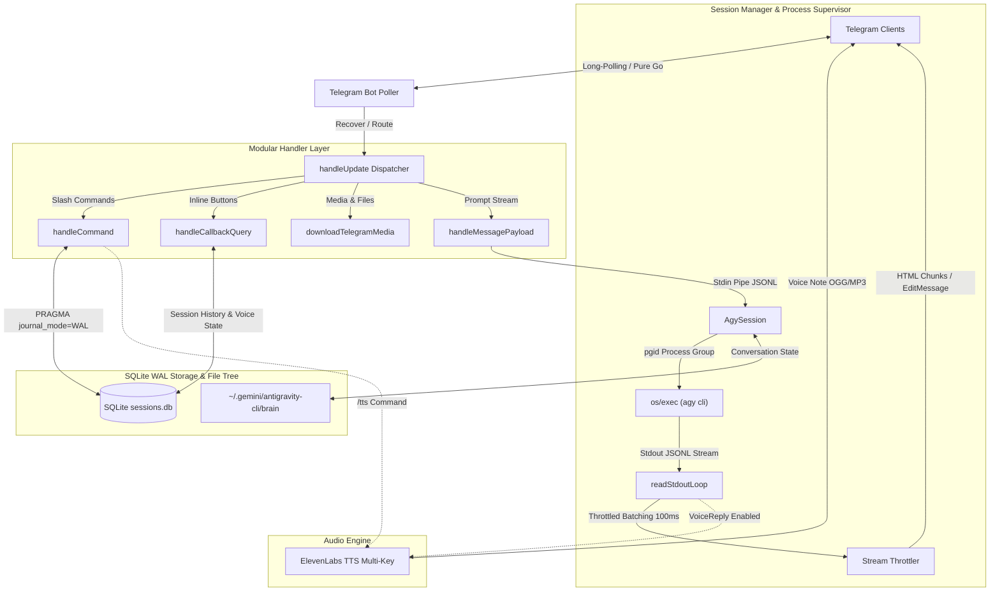
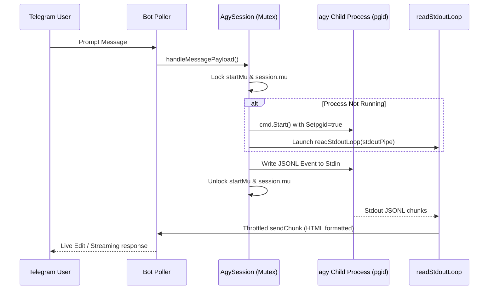
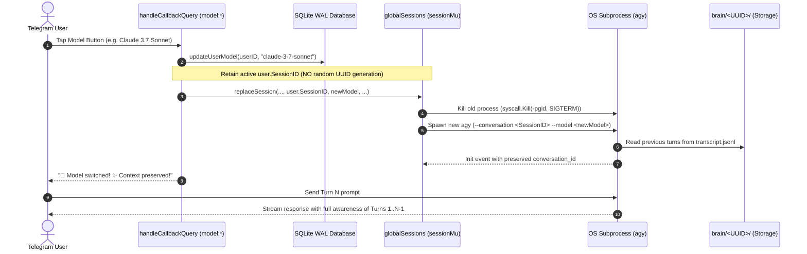
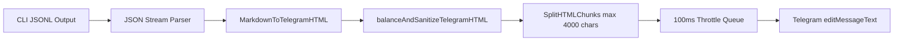

# 🛸 Antigravity Go Telegram Bot Agent — Architecture Specification

## 1. Executive Summary

The `antigravity-go-tg-bot-agent` is an ultra-low-latency, concurrent Telegram Gateway and session supervisor written in pure Go for Google Antigravity CLI (`agy`) headless agentic workflows. 

Rather than embedding heavy runtime dependencies directly into bot processes, the engine acts as an asynchronous multiplexing bridge between the Telegram Bot API and isolated agent CLI subprocesses. Each user interacts with an isolated runtime environment with robust state persistence, non-blocking I/O streaming, real-time Markdown-to-HTML conversion, and self-healing error recovery.



---

## 2. Core Architectural Pillars

### 2.1 Concurrency & Race-Free Thread Model
The gateway is engineered under strict Go concurrency invariants (`go test -race` validated):

* **Granular Mutex Protection (`session.mu sync.Mutex`)**: Guards session mutable fields (`Stdin`, `isAlive`, `Conversation`, `BotAPI`, `ChatID`, `ActiveMessageID`, `TextBuffer`, `VoiceReply`).
* **Subprocess Startup Serialization (`session.startMu sync.Mutex`)**: Guarantees that concurrent incoming user prompts cannot spawn duplicate child processes or race during `os/exec.Command.Start()`.
* **Safe Pointer Publishing**: Child `session.Stdin` and `session.Cmd` are published exclusively **after** successful `cmd.Start()`, preventing nil-pointer dereferences in concurrent readers.
* **Process Group Isolation (`Setpgid: true`)**: All spawned `agy` processes are assigned a dedicated process group (`syscall.Kill(-pgid, syscall.SIGKILL)`). On `/clear`, `/workspace`, or daemon shutdown, entire child process trees (including compiler sub-processes and Python workers) are reliably terminated without leaving orphaned zombies.
* **Mutex-Decoupled Process Termination (`AgySession.Kill()`)**: Mutex `session.mu` locks state updates exclusively for fast field mutation (`isAlive = false`, zeroing pointers). Blocking I/O (`Stdin.Close()`) and kernel process signals (`syscall.Kill`) execute outside the lock, preventing thread contention and eliminating potential deadlocks during concurrent stream reads.



---

## 3. Modular Handler Decomposition

The monolithic message processing loop has been refactored into modular, testable components:

| Handler Function | Responsibility | Concurrency & Security Rules |
| :--- | :--- | :--- |
| `handleStartCommand` | Live agent terminal dashboard (CWD, model, session uptime, steps count, quick action buttons). | Non-blocking file reads from `.title` and `transcript.jsonl`. |
| `handleResumeCommand` | Interactive session picker with relative modification timestamps and `<USER_REQUEST>` prompt titles. | Queries SQLite history + reads `brain` directory. |
| `handleModelCommand` | Dynamic model selection keyboard. | Read-locked cache (`modelsMu.RLock()`). |
| `handleRefreshModelsCommand` | Live fetch of supported LLMs from `agy --print /models`. | Write-locked cache update (`modelsMu.Lock()`). |
| `handleUsageCommand` | Token quota and API tier usage display. | Executes `agy --print /usage`. |
| `handleHelpCommand` | Quick command reference and operational guide. | Pure static format. |
| `handleTTSCommand` | Text-to-Speech synthesis for arbitrary user text. | Multi-key ElevenLabs rotation. |
| `handleVoiceToggleCommand` | Persistent toggle for agent voice responses (`/voice [on\|off]`). | Atomic SQLite update to `users.voice_reply` and active in-memory session sync. |
| `handleWorkspaceCommand` | Dynamic agent working directory switching. | Path traversal validation (`isPathUnderRoot`, restricted to `PROJECTS_DIR` or bot's own office). |
| `handleRenameCommand` | Live rename of conversation title in `brain` storage. | Sanitizes title and validates conversation ID against path traversal. |
| `handleExportCommand` | Compiles full conversation transcript JSONL into a clean Markdown file attachment. | Validates session ID format (`isValidSessionID`), writes export file to scratch space. |
| `handleClearCommand` | Session context reset for clean startup. | Cleans session state in DB and memory, launches fresh process without uninitialized conversation ID flags. |
| `handleCommand` | Centralized strict command token router (`switch cmd`). | Strips `@botName` and matches exact command tokens, eliminating prefix collisions (`/workspacex`, etc.). |
| `handleCallbackQuery` | Routes inline button actions (`model:*` [Hot Model Swap], `resume:*`, `ans_id:*`, `cmd:*`). | Broken Object Level Authorization (BOLA) guard (`isSessionOwnedByUser`), safe UTF-8 byte truncation (`truncateUTF8Bytes`), safe prefix slicing, and expired callback query feedback. |
| `downloadTelegramMedia` | Downloads incoming documents, photos, audio, and voices. | URL scheme & host validation (HTTP/HTTPS only), HTTP status check, 100 MB hard limit, and sandbox download dir. |
| `handleMessagePayload` | Streams user prompt into agent `Stdin` and triggers instant `sendChatAction`. | Enforces JSONL protocol encoding, per-turn voice reply mode without latching, and clean prompt retry on Stdin error. |
| `sendTypingAction` | Background 4-second ticker sending `ChatTyping` / `ChatRecordVoice` while agent thinks. | Non-blocking mutex check. |
| `ExtractAllowedArtifacts` | Validates and dispatches generated documents/artifacts to Telegram. | Fail-closed LFI sandbox (`isPathUnderRoot`) covering `AGENTS_DIR`, `BRAIN_DIR`, and `PROJECTS_DIR` (`!info.IsDir()`). |
| `sendArtifacts` | Sends verified artifacts as Telegram documents. | Opens file descriptors directly (`os.Open`) and streams via `tgbotapi.FileReader`, eliminating path TOCTOU symlink races. |
| `AgySession.start` | Spawns `agy` sub-process with `Setpgid`, `WaitDelay`, and streaming throttler. | Monitors `cmd.Wait()` to clean up zombie `*⏳ Thinking...*` UI states on unexpected process exit. |

---

## 4. SQLite WAL Mode & Persistence Architecture

The engine uses embedded SQLite with Write-Ahead Logging for high-concurrency resilience:

### Database Optimizations:
```sql
PRAGMA journal_mode = WAL;
PRAGMA busy_timeout = 5000;
PRAGMA synchronous = NORMAL;
```
* **WAL Mode (`PRAGMA journal_mode=WAL;`)**: Enables concurrent readers while a writer executes, completely eliminating `database is locked` runtime collisions. Fail-Fast enforced at startup.
* **Busy Timeout (`PRAGMA busy_timeout=5000;`)**: Automatically retries locked transactions for up to 5 seconds before returning an error. Fail-Fast enforced at startup.
* **Synchronous Normal (`PRAGMA synchronous=NORMAL;`)**: Maximizes SQLite write throughput while guaranteeing ACID consistency in WAL mode. Fail-Fast enforced at startup.

### Schema:
```sql
CREATE TABLE IF NOT EXISTS users (
    user_id INTEGER PRIMARY KEY,
    workspace TEXT,
    model TEXT,
    session_id TEXT,
    voice_reply BOOLEAN DEFAULT 0
);

CREATE TABLE IF NOT EXISTS session_history (
    id INTEGER PRIMARY KEY AUTOINCREMENT,
    user_id INTEGER,
    session_id TEXT,
    created_at DATETIME DEFAULT CURRENT_TIMESTAMP
);
```

---

## 5. Hot Model Swap Architecture (Zero-Context-Loss Model Switching)

The engine supports seamless switching of LLM models mid-conversation without loss of history or context:



### Hot Swap Guarantees:
1. **Zero Context Loss**: Previous messages, tool executions, and user inputs stored in `~/.gemini/antigravity-cli/brain/<UUID>/` are reloaded by `agy` on startup under the new model.
2. **Atomic Process Handoff**: `replaceSession` closes active I/O pipes and terminates the old process group before provisioning the new model runner, avoiding CPU/memory leaks.
3. **Database Consistency**: Only `users.model` is updated in SQLite; `users.session_id` remains immutable across swaps until the user explicitly runs `/clear`.

---

## 6. Streaming Engine & HTML Sanitize Pipeline

Agent standard output streams JSONL objects that are parsed and formatted into Telegram HTML:



1. **Tag Balancing & Sanitization**:
   - Telegram HTML strictly allows: `<b>`, `<i>`, `<code>`, `<pre>`, `<a href="...">`, `<tg-spoiler>`, `<blockquote>`.
   - `balanceAndSanitizeTelegramHTML` closes any unclosed tags on chunk boundaries to prevent Telegram API `400 Bad Request: can't parse entities` errors.
2. **Chunking Engine (`SplitHTMLChunks`)**:
   - Accurately partitions content at paragraph boundaries `<p>` or `\n\n` without breaking HTML tags across chunks.

---

## 6. Environment & Path Resolution Matrix

All hardcoded filesystem paths are decoupled and configurable via environment variables:

| Environment Variable | Default Path | Purpose |
| :--- | :--- | :--- |
| `AGENTS_DIR` | `/root/.agents` (or `~/.agents`) | Base directory containing agent workspaces and download scratchpads. |
| `BRAIN_DIR` | `/root/.gemini/antigravity-cli/brain` (or `~/.gemini/antigravity-cli/brain`) | Storage for agent conversation logs, titles, and step histories. |
| `AGY_BINARY` | `/root/.gemini/antigravity-cli/bin/agy` (or `~/.gemini/...` or `PATH`) | Path to Antigravity CLI executable. |
| `ADMIN_USER_IDS` | `""` | Comma-separated list of authorized Telegram User IDs. |
| `ELEVENLABS_API_KEY` | `""` | Comma/newline separated list of ElevenLabs API keys (supports automatic rotation). |
| `ELEVENLABS_BASE_URL` | `https://api.elevenlabs.io/v1/text-to-speech` | Configurable base URL for testing and reverse proxies. |
